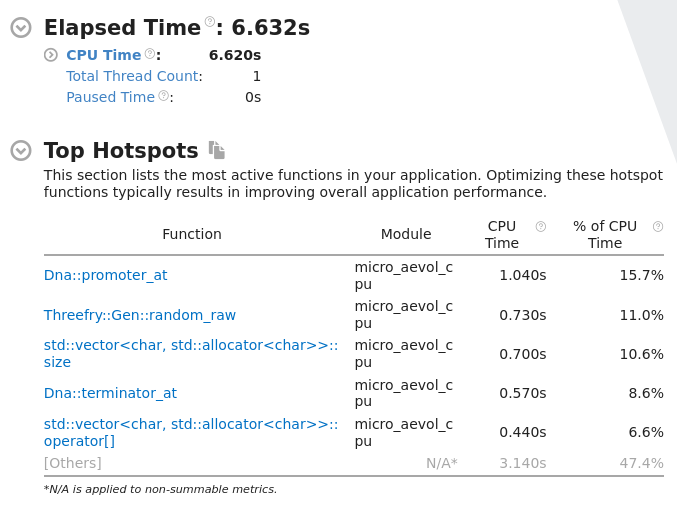
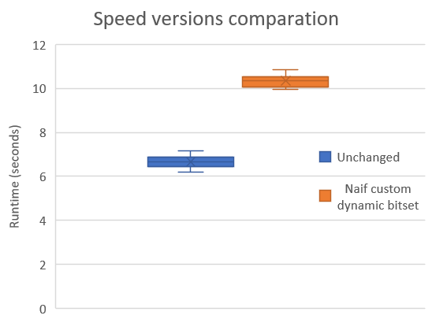
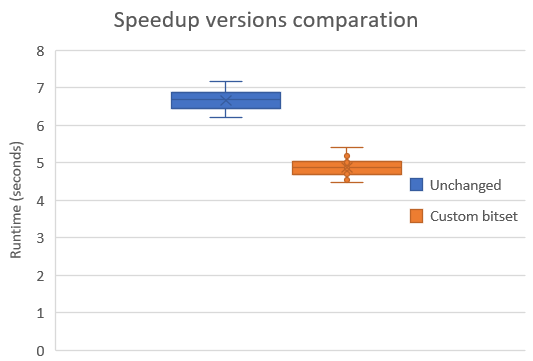
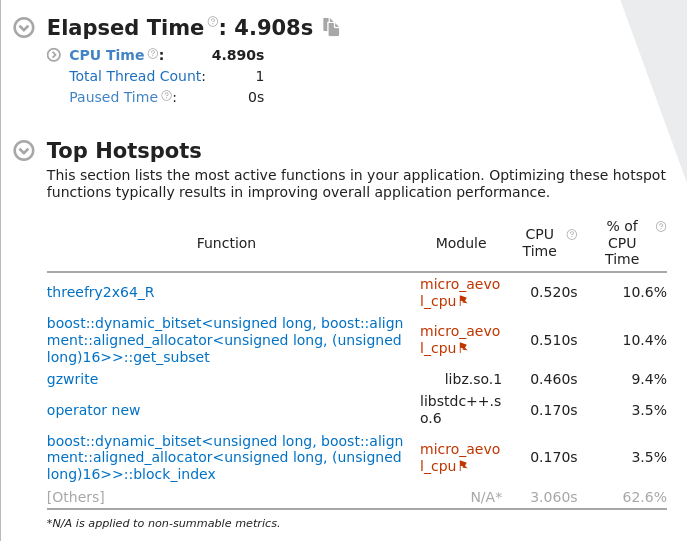

# TP Micro-aevol2

## Members
Julian PREIN  
Jorge KORGUT Junior

## Project architecture

The project contains 2 majors optimizations that can be found in the following
branches:

[ :pushpin: **final-unchanged**  ](https://github.com/jorgekorgut/micro-aevol2/tree/final-unchanged) : This branch, contains the first version without any modification. This was the starting point of our project.

[ :pushpin: **final-custombitset**](https://github.com/jorgekorgut/micro-aevol2/tree/final-custombitset) : This was the first optimization implementation. The idea was to encode the DNA in a bitset, to gain performance by fastly comparing the wanted sequences.

[ :pushpin: **master**](https://github.com/jorgekorgut/micro-aevol2/) : After gaining performance with the bitset, the main goal of this step was to convert all the particularities from bitset to the GPU. The propretary language CUDA was used.

### Dependencies

For being able to launch our project, you will need CUDA nvcc compiler installed and the boost library installed inside boost folder.  

**Cuda** : [CUDA installation guide](https://docs.nvidia.com/cuda/cuda-installation-guide-linux)

**Boost** : [BOOST Getting started](https://www.boost.org/doc/libs/1_84_0/more/getting_started)  

Extract and install the files from boost following the following folder hierarchic example. The boost folder can be found in the root of the project. 
Ex : ```boost/boost_1_83_0```  

#### :warning: Known errors

* ```error: parameter packs not expanded with ‘...’```  

The error comes probably because you have installed cuda-toolkit from the unix package manager. The solution I found to this error is to uninstall every package related to cuda and then reinstall it following the exact instructions from [CUDA installation guide](https://docs.nvidia.com/cuda/cuda-installation-guide-linux)  

* ```Could NOT find CUDA (missing: CUDA_NVCC_EXECUTABLE CUDA_CUDART_LIBRARY)```  

The reason for this error is the missing CUDA path directory for **nvcc** and the CUDA library. To fix it just add this lines into your ~/.bashrc 
```
export PATH=/usr/local/cuda-12.3/bin${PATH:+:${PATH}}
export LD_LIBRARY_PATH=/usr/local/cuda-12.3/lib64${LD_LIBRARY_PATH:+:${LD_LIBRARY_PATH}}
```

### Launching the project  

After cloning the repository execute `bootstrap.sh` to install and setup our
boost fork dependency.

As mentioned before, every branch is tagged with a prefix _**final-**_ before the optimization type used. Therefore, for launching the project with a specific optimization, change branches to the wished one.

```
git checkout final-#
```  

Then create a new folder inside projects.

```
mkdir project/build
```  

Launch cmake inside the folder you have created.

```
cd project/build
cmake .. -DUSE_CUDA=on
```  

Build the project
```
make -j
```  

To measure the application execution time, you can execute the following unix application.  
```
time project/build/micro_aevol_#
```

## Report  

### Introduction
The objective of this project is to optimize the run of the MICRO-AEVOL application. This wide scope was purpose chosen to allow us to explore different solutions either with hardware and software optimization. In what concerns this project, 2 main axes will be focused on : algorithm run time and memory space.

### Bitset
By analyzing the initial code and running it on profiler tools (INTEL VTUNE), we remark that a lot of the runtime was spent traversing the DNA sequence. Therefore this had become our first optimization target.


  
_Micro-aevol run profiled with Intel VTune showing the application hot paths_  


Diving into the existing code we discover one of the reasons why the application spends a significant amount of time on the DNA sequence. In summary multiples algorithms used in our application iterates over the DNA to find patterns. For example, in one of them, we need to extract the promoter in a determined position. For doing so, we cover all the DNA iterating position after position and comparing the starting sequence to a reference and constant pattern, saving its distance for later on.

* [int Dna::promoter_at(int pos)](https://github.com/jorgekorgut/micro-aevol2/blob/final-unchanged/project/Dna.cpp#L125C1-L125C1)  

For that reason, using the classical character vector c++ implementation forces the iteration over the array every time we want to reach our objectives. This approach waste a lot of memory and causes unwanted cache misses to fetch data from further and slower memories.

Therefore, the first optimization idea that pops up is to replace this structure by a bitset. But what is a bitset ?

A bitset is a fundamental data structure in computer science that is used to represent a fixed-size sequence of binary digits. 

However, for our purpose, the number of digits is defined on run-time. Thus we are not able to use the simple implementation to build our data in, we are constraint to implement a dynamic version of this data structure.  

With a little bit of research, we step into a dynamic bitset library called BOOST. This allows us to save up some development time and discover the meticulous details of its implementation. BOOST implements the dynamic bitset as a dynamic array of blocks that are user defined. These blocks are values and represent one unit of storage supporting the same amount of elements as in its bit length. For example : a block of type uint64_t has 64 bits of length and supports 64 elements inside of it.

The next step is to adapt the original MICRO-AEVOL code, replacing the character vector by our dynamic bitset. However, this data structure limit our use case to only 2 different genetics codes. If we want to implement the 4 different ones, the dynamic bitset would still be possible, but an adaptation to 2 instead of 1 bits is required.

  
_Micro-aevol run time execution showing lost of performance with boost dynamic bitset. This graph was constructed running 20 times each version and then plotting the result._  

The loss of time performance was expected since we simply replaced the structure but we did not use the full potential of the bitset. Even if we did not win the performance we wished for, we saved up a good amount of space in memory. Indeed, before we used the bit length of a character times the length of the sequence to represent 1 DNA and now we use the ceiling of the length of the sequence divided by the bit length of a block in the dynamic bitset.
To illustrate, if we use a block of uint_64, we economize ```8 * n / (n / 64) = 512```. That is **512 times less memory** to represent the same DNA in the previous version.

Knowing the full potential of bitset, the focus is on modifying the algorithm's logic to work with our new approach. To be precise, we changed the loops of 5 main functions :  

 * promoter_at  
 * terminator_at  
 * shine_dal_start  
 * protein_stop  
 * codon_at  

The common thing we remark on all these functions is an inner loop to check if a specific pattern is found. Knowing that these patterns are constant and that they are smaller than our max available block bit size, we could heavily optimize these functions.  

To benefit from the optimizations that BOOST's engineers had already think of, we added a new function to their library :

* [get_subset(size_type pos, size_type len)](https://github.com/druckdev/dynamic_bitset/blob/42271ad9e47df986ec585f8aaa691c34a0819c67/include/boost/dynamic_bitset/dynamic_bitset.hpp#L1401C1) 

This function returns a block with the starting bit defined by pos and the last one defined by pos + len - 1. The rest of its bits are 0. In short, function uses binary operators to quickly retrieve, construct and return our target sequence.  

With this new helper function, we could adapt our previous functions and surprisingly we had a really nice interface to work with.  

This optimization led our program to execute faster than the previous version and the unchanged one. 

  

_Run time comparison of the starting version of Micro-Aevol and the one with custom dynamic bitset. This graph was constructed running 20 times each version and then plotting the result._  

  

_Micro-aevol custom dynamic bitset version run profiled with Intel VTune showing the application hot paths_  

It is interesting to notice the loss of the relative time spent on the DNA sequence and the total speedup obtained using this optimization method. 

### GPU

After optimization the CPU executable we switched over to the GPU. We started by
a very naive replacement of all the `char`, `*int8_t` and `uint` arrays we could
find to a bitset in the form of `block *` (i.e. `uint64_t`). This obviously
broke the functionality of the program.

From here on we started to also slowly port the functionality of every function
using those arrays. This consisted mostly of adjustments in uses of indices and
lengths in loops, but also of more complex parts like introducing specific
atomic operations since different threads might need to access the same bytes
because of the denser memory layout. In this step we also partially reverted
back to `uint` arrays for the arrays holding indices (e.g. `terminator`,
`prot_start`). At the end of this we had working code again, that would run
approximately 1.6x faster.

#### TODO

- highlight with benchmark results
- mention clean_population_metadata
- use nvprof output to compare functions
- use atomicAdd to parallelize sparse_*

